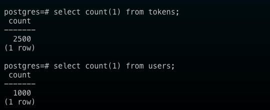

# Coworking Space Service Extension

## Deployment database
### **Deploy postgresql through helm**
```sh
helm repo add bitnami https://charts.bitnami.com/bitnami
helm install postgresql bitnami/postgresql --set primary.persistence.enabled=false --set postgresqlPassword=postgres
```

### **Initiate database**
- After installing helm chart to `eks` successfully. Run the bellow command instruction to initiate database schema and data
```sh
# goto db folder
cd ../db

kubectl port-forward --namespace default svc/postgresql 5432:5432
PGPASSWORD="$POSTGRES_PASSWORD" psql --host 127.0.0.1 -U postgres -d postgres -p 5432 < 1_create_tables.sql
PGPASSWORD="$POSTGRES_PASSWORD" psql --host 127.0.0.1 -U postgres -d postgres -p 5432 < 2_seed_users.sql
PGPASSWORD="$POSTGRES_PASSWORD" psql --host 127.0.0.1 -U postgres -d postgres -p 5432 < 3_seed_tokens.sql
```
- result: </br>


## Deployment Application
- build and push docker image to `AWS ECR` through `AWS CodeBuild`
- Application will be deployed to `AWS EKS`
- Every time there is a commit to `main` branch, sourcecode will be build and deploy to `eks` </br>
please refer to [buildspec.yaml](./buildspec.yml)
</br> or you can deploy from your local pc by using the bellow command
```sh
cd deployment
# update kubectl config
aws eks update-kubeconfig --name <<YOUR_CLUSTER>> --verbose

# replace image uri that is a result of codebuild in previous step

# run deployment to eks cluster
kubectl apply -f .
```
